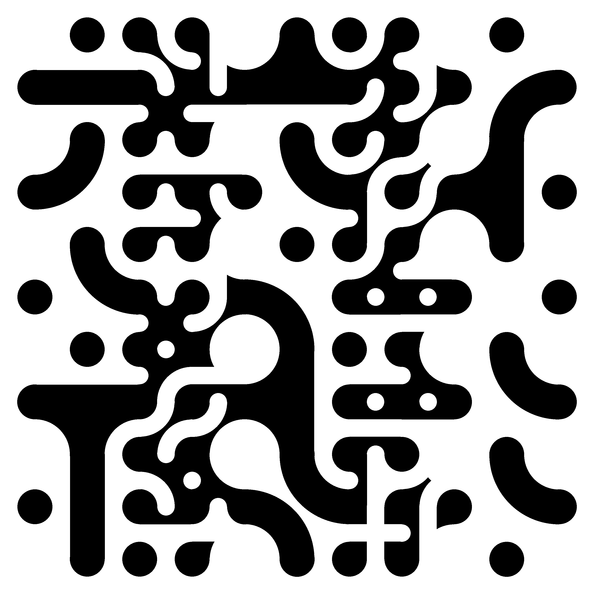

# py-multiscale-truchet
A Python implementation for Multiscale Truchet tasselation (<https://christophercarlson.com/portfolio/multi-scale-truchet-patterns/>)

To generate a new MultiScale Truchet, just launch:

```shell
python main.py
```

In main.py:

*how_many_tiles*, defines how many tiles per row and colums to generate

*of_size*, defines the size of each and every tile in the image




